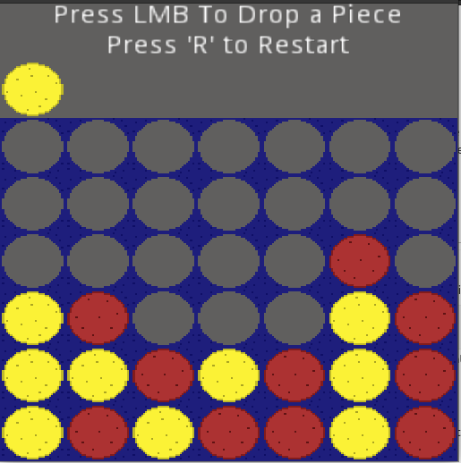

# Connect 4 Godot
A Simple implementation of Connect 4 in the Godot game engine to get more familiar with how the engine works. Art for this project was also made by me, feel free to use any parts of the project hower you want.

# Demo Image

